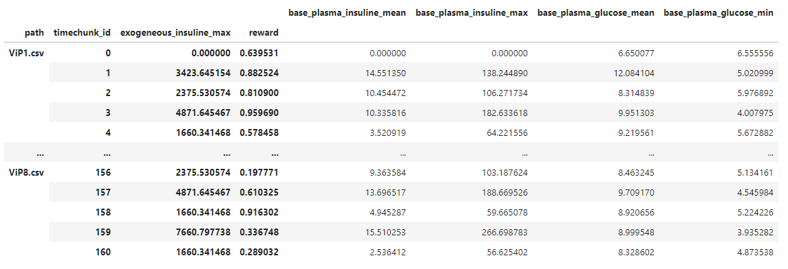
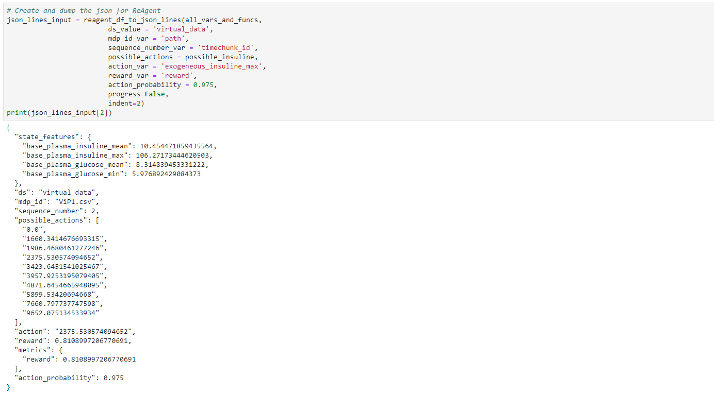

# What is ReAgent_workflow
`ReAgent_workflow` cprovides a set of common tasks that you need to perform in order to run [ReAgent](https://reagent.ai/) effectively. These include:

- Setting up new runs
- preprocessing raw data into timeline data
- Launching runs
- Easily change settings in runs
- Track logging information regarding what has been done

The main interface is a commandline script called `reagent`. This uses `git` style subcommands:

- `init` initialize a ReAgent run
- `run` run ReAgent

The rest of this readme will describe how to setup `ReAgent_workflow`, and how to work with it. 

You can find the [technical documentation of the code here](https://htmlpreview.github.io/?https://github.com/ictinnovaties-zorg/ReAgent_workflow/blob/master/doc/ReAgent_workflow/index.html), this is mainly useful if you want to write your own Python scripts that work with `ReAgent`. The package also includes some example runs in the `exampple_runs` subdirectory. This typically involves a bash script which creates the runs, and a Jupyter Notebook for the interpretation. 

# TL;DR
Short example run from the command line (note that the example files are included in the `example_data` directory in the package):

    reagent init cartpole_run generated_cartpole_data.json --delete-old-run 
    cp example_full_run_config.json cartpole_run
    cd cartpole_run
    reagent run -r example_full_run_config.json
    reagent run -r example_full_run_config.json --ts learning_rate 0.1

Help for init:

    usage: reagent init [-h] [-o] [-d] name training_data
    
    This clones the repository in REAGENT_LOCATION, copies in 
    the training data and builds the preprocessing JAR file using 
    Maven. Finally, it copies the run log into the directory 
    created by git. This log, run_activity.log, contains all 
    the activity that took place in the run.
    
    positional arguments:
      name                  Name of the run
      training_data         Training data used for the run
    
    optional arguments:
      -h, --help            show this help message and exit
      -o, --delete-old-run  Delete the run in `name` if it already exists.
      -d, --debug           Do not buffer the Python errors, useful during
                            development

    Example usage:

        reagent init cartpole_run generated_cartpole_data.json --delete-old-run 

Help for run:

    usage: reagent run [-h] [-r RUN_SETTINGS] [-s] [-d] [--ps key value] [--ts key value]
    
    Run ReAgent from the command line. 
    
    Note that if you want to pass multiple preprocessing 
    or training settings, you can call `--ps/ts` multiple times. 
    
    optional arguments:
      -h, --help            show this help message and exit
      -r RUN_SETTINGS, --run_settings RUN_SETTINGS
                            Path to a settings file containing the global settings
                            for this run
      -s, --skip-preprocessing
                            Skip preprocessing, and immediately launch the run
      -d, --debug           Do not buffer the Python errors, useful during
                            development
      --ps key [value ...]  Pass preprocessing setting
      --ts key [value ...]  Pass traininging settings
    
    Example usage: 
    
        reagent run -r config.json --skip-preprocessing
        reagent run -r config.json --s --ts learning_rate 0.1
        reagent run -r config.json --s --ts learning_rate 0.1 --ts epochs 999

# FAQ
`ReAgent_workflow` is in its early stages of development, so the experience of installation and running is not quite fire-and-forget. Below I list some common issues, and what you can do to fix them. 

#### I get a `cannot find module ml.core` error
This means that you either have not installed `ReAgent` using `pip install .`, or that you are not running `reagent run` from the directory that `reagent init ` created. ReAgent needs to run from a full copy of the source files, at least that was the way I could get it working. 

#### I get a `cannot find module xxxxx error`
The installation instructions are not always rock solid, so there could be some missing libraries. Simply running `pip install xxxxx` in the conda environment where you run ReAgent from should often fix this issue. 

#### How do I test the performance of a generated model (aka Policy)? 
ReAgent_workflow currently does not provide a standard way of doing this as there is none. You need to write your own code that evaluates the generated PyTorch model. For the cartpole example I use throughout this readme this is done using:

	python ml/rl/test/workflow/eval_cartpole.py -m outputs/model_* --softmax_temperature=0.35 --log_file=outputs/eval_output.txt

This script would be the best starting point to make your own evaluation script. 

Note that the script above uses a the cartpole *model* to evaluate. The problem ofcourse is that we are using ReAgent precisely because we do not have a model. Maybe you could split the data into testing and training as a solution, effectively doing some kind of crossvalidation. 

# Setting up ReAgent
By and large you can follow the [installation guide](https://reagent.ai/installation.html#installation) provided with ReAgent. I do present a number of additional steps below. 

## Getting ReAgent
The best way to get ReAgent is to simply clone the git repo:

    git clone --recurse-submodules https://github.com/facebookresearch/ReAgent.git

If you run into a problem with one of the submodules not loading properly, [you can find the solution here](https://github.com/facebookresearch/ReAgent/issues/204). 

## Installation tweaks
- I created a conda environment for ReAgent, although you could also use `virtualenv` if you don't run Anaconda as I do. Before following the install guide, create and activate the conda env:

        conda create --name ReAgent
        conda activate ReAgent
    
    Once this environment is activated, you can run commands such as `conda install` or `pip install` to install all the required software. Note that before running ReAgent, you always need to activate the environment. 

- I installed pytorch using `conda (note that pytoch itself is already installed as part of requirements.txt):

        conda install pytorch torchvision cudatoolkit=10.1 -c pytorch 

- The install manual asks you to set `JAVA_HOME` using `dirname` and `which conda`. I suggest you use `which java` as this is much more robust when working in a conda env. If you do not use this, the `JAVA_HOME` will be set to the main anaconda dir, and not the one for the specific environment. 

         export JAVA_HOME="$(dirname $(dirname -- `which java`))"    

    be sure to install a JAVA JDK (not simply JRE), and install version 8. 

- The installation manual mentions not having to run pip again after updating the package, but this did not seems to work for me. So after:

        git pull origin master
    
    run:

        pip install .

- This ReAgent script depends on having ReAgent downloaded and ready on your system. The script finds the install via the `REAGENT_LOCATION` environment variable. Under bash this is done by adding:

	    export REAGENT_LOCATION="/path/to/ReAgent"

    to the environment variables file of your conda environmet. See [this link](https://docs.conda.io/projects/conda/en/latest/user-guide/tasks/manage-environments.html#macos-and-linux) how to do this. Practically, this is the contents of my files:
    
    **activate.d/env_vars.sh**
    
        #! /bin/sh

        # Some extra stuff for ReAgent
        export PATH="/usr/local/spark/bin:$PATH"
        export JAVA_HOME="$(dirname $(dirname -- `which java`))"
        export REAGENT_LOCATION="/my/location/of/reagent"
        
    **deactivate.d/env_vars.sh**
    
        unset JAVA_HOME
        unset REAGENT_LOCATION
        
    Notice that I don't unset `PATH`. So spark will continue to be on the PATH even if you deactivate the ReAgent environment. This is something I'd like to fix in the future. 

## Installing ReAgent_workflow
In order to get the scripts working you need to:

- Clone the repo
- Install the package using:

        cd ReAgent_workflow
        pip install .

This will install the package and the command line script called `reagent`. 

# Running ReAgent from the commandline
Setting up a new ReAgent run is done using the `init` subcommand:

    reagent init run_name bla.json

where:

- `run_name` the name of the run, this is also the directory where the run will be stored. 
- `bla.json` the input data for the run. See the [ReAgent usage page](https://reagent.ai/usage.html#offline-rl-training-batch-rl) for the needed format. 

This clones the repository in `REAGENT_LOCATION`, copies in the training data and builds the preprocessing JAR file using Maven. Finally, it copies the run log into the directory created by git. This log, `run_activity.log`, contains all the activity that took place in the run. 

After setting up an new run, you can start training models:

    reagent run --skip-preprocessing -r settings_config.json 

For now this runs a discrete action DQN as is used in the example on the ReAgent site. 

Below I describe the basic working of `reagent run`, the full detailed technical documentation can be had via `reagent run -h`. 

- `--skip-preprocessing` skip processing and directly start training a model. You can use this to repeatedly retrain a model with the need of having to rerun the preprocessing (generate timeline data, generate normalisation params). 
- `-r settings_config.json` optional settings file that enables you to change preprocessing and training settings in the run. For more details see the section below. 

In addition to the settings file, `reagent` also allows you to pass settings on the command line. This is done vvia the `--ts` and `--ps` for training settings and preprocessing settings respectively. For example:

    reagent run -r settings_config.json --ts learning_rate 0.0001

reads the settings from the file, but replaces the learning rate by `0.0001`. You case pass multiple values by simply calling `--ts` multiple times

    reagent run -r settings_config.json --ts learning_rate 0.0001 --ts epochs 300

will read the file and replace learning rate and number of epochs. **NOTE** you can pass settings via `--ts`and `--ps` that are not in `settings_config.json`. You can even omit the settings file completely and pass everything via the commandline.  

## Contents of a run
The resulting run contains a number of of key files that tell you about the settings and the results:

- `outputs`, contains the training results. 
- `training_data`, contains the input training and evaluation data
	- `training_data/training_data.json` timeline training data to train the model on
	- `training_data/evaluation_data.json` evaluation data in timeline format. 
	- `training_data/state_features_norm.json` normalisation parameters used during training
- `current_normalisation_config.json` settings used to generate the normalisation parameters
- `current_training_config.json` settings used to train the model
- `current_timeline_config.json` settings used to generate timeline data
- `spark_raw_timeline_{training/evaluation` the raw results files from spark in timelineformat
- `spark-warehouse derby.log metastore_db` spark files

## ReAgent run settings file
The following is an example of a settings file:

    {
      "preprocessing": {
         "ds_value": "2019-01-01",
         "actions": ["0", "1"] 
      },
      "training": {
         "epochs": 99,
         "learning_rate": 0.1
      }
    }

it contains two sections: `preprocessing` and `training`. 

- The first allows you to change preprocessing settings in the `preprocessing` template (`ml/rl/workflow/sample_configs/discrete_action/timeline.json`). The two settings, `ds_value` and `actions`, are things you probably need to change for your run.  
- The second allows you to change settings for the training phase. Any setting in `'ml/rl/workflow/sample_configs/discrete_action/dqn_example.json` can be changed. 

Note that it does not matter how deeply nested any of the settings are, the replacement algorithm will recursively go through the entire config tree and replace the value. For example, `learning_rate` is actually one level deep (`training > learning_rate`), but there is no need to mimic this depth. Simply pass `learning_rate` and the script will do the rest. 

## Full run example
First we set up an new run and perform one training run:

    reagent init cartpole_run generated_cartpole_data.json --delete-old-run 
    cp example_full_run_config.json cartpole_run
    cd cartpole_run
    reagent run -r example_full_run_config.json

Note that `example_full_run_config.json` and `generated_cartpole_data.json` are included in this repo in the `example_data` subdirectory.

If we want to run the exact same run, but with a learning rate of `0.001`, you can edit the config file and:

    reagent run -r edited_config.json --skip-preprocessing

This will not run the preprocessing, and retrain the model with the new learning rate. Alternatively, you could have not edited the file, but passed the new value via the command line:

    reagent run -r example_full_run_config.json --ts learning_rate 0.001

which yields the exact same result. 

# Running ReAgent_workflow from within Python
The main supported interface currently is the commandline interface. For the brave of heart, the [technical documentation of the code here](https://htmlpreview.github.io/?https://github.com/ictinnovaties-zorg/ReAgent_workflow/blob/master/doc/ReAgent_workflow/index.html) points you towards the underlying Python functions. You could use this to create and manage ReAgent runs from within Python. 

There are a few functions that you can only run from within Python, these are listed here:

## Generate ReAgent JSON from a pandas dataframe
One of the challenges we have is to generate the required [JSONlines](http://jsonlines.org/) data for ReAgent. The function `reagent_df_to_json_lines` facilitates with this challenge. It transforms the following Pandas DataFrame:

to a list with the required json. 

A number of support functions help out with generating the input pandas DataFrame:

- `create_features` aggregate over a set of grouping variables and summary functions.
- `discretize_action_space` take a list of numbers representing actions and return a discretized version. 

The details of the functions can be found in the [technical documentation](https://htmlpreview.github.io/?https://github.com/ictinnovaties-zorg/ReAgent_workflow/blob/master/doc/ReAgent_workflow/index.html), under the `process_json` submodule. Importing any of the functions is done like this:

    from ReAgent_workflow.process_json import create_features

# Copyright
Copyright 2020 Research group ICT innovations in Health Care, Windesheim University of Applied Sciences. 
